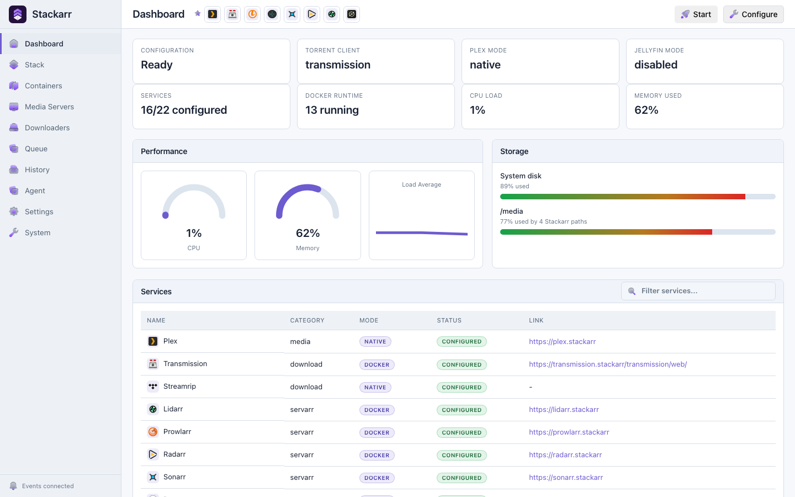

<div align="center">
  
  <h1>Stackarr</h1>
  <p><strong>Manage your self-hosted media stack from chat.</strong></p>
  <p>
    <a href="https://stackarr.app">Product</a>
    ·
    <a href="https://stackarr.app/docs">Quick start</a>
    ·
    <a href="https://stackarr.app/docs/agent/mcp">Connect an agent</a>
    ·
    <a href="https://stackarr.app/docs/installation">Install</a>
  </p>
</div>

<picture>
  <source media="(prefers-color-scheme: dark)" srcset="apps/docs/public/screenshots/stackarr-dashboard-dark.png" />
  
</picture>

Stackarr is a Docker control plane for a private media stack. It gives Codex, Claude, Hermes, OpenClaw, LM Studio, and other MCP clients consistent actions for setup, media requests, downloads, backups, health checks, and repairs.

The dashboard stays available at the same time, so you can move between chat and manual control whenever you want.

> [!WARNING]
> Stackarr is early-access software. Keep the dashboard bound to `127.0.0.1` until authentication and remote access are configured.

## Install

```bash
mkdir -p stackarr && cd stackarr
curl -fsSL https://stackarr.app/docker-compose.yml -o docker-compose.yml
docker compose --profile stackarr up -d app
```

Open [http://127.0.0.1:7777/setup](http://127.0.0.1:7777/setup).

## Connect an agent

Generate the Codex connection from the running container:

```bash
docker exec app /app/bin/stackarr mcp config codex --profile admin
```

Run the generated command on the Docker host. Replace `codex` with `claude`, `lmstudio`, `chatgpt`, `hermes`, or `openclaw` to generate that client's setup. ChatGPT uses an outbound-only Secure MCP Tunnel so the homelab does not need a public MCP port.

Then ask:

> Inspect my new Stackarr install. Recommend safe defaults, show me a dry-run, and ask before applying changes.

Use `admin` during setup and `manage` for everyday operation. `observe` is read-only. `unrestricted` deliberately grants complete autonomous control without per-action approval prompts.

## What Stackarr manages

| Area | Examples |
| --- | --- |
| Movies and TV | Radarr, Sonarr, Seerr, Plex, Jellyfin |
| Downloads and indexers | Transmission, qBittorrent, Prowlarr |
| Music, books, photos, and games | Lidarr, BookOrbit, Immich, RomM |
| Supporting services | Bazarr, Recyclarr, Maintainerr, Tracearr, FlareSolverr |
| Operations | Setup, health, backups, restores, updates, and migrations |
| Access | Local-only defaults and optional Cloudflare routes |

Stackarr advertises only the agent actions relevant to the apps selected during setup.

## Safety

- local stdio MCP transport
- launch-time authority profiles that agents cannot change
- typed app actions instead of a generic shell
- approval prompts for destructive actions in `manage` and `admin`
- redacted activity history
- optional `unrestricted` authority for users who want full control

## Documentation

- [Quick start](https://stackarr.app/docs)
- [Docker installation](https://stackarr.app/docs/installation)
- [MCP connections](https://stackarr.app/docs/agent/mcp)
- [Hermes and OpenClaw](https://stackarr.app/docs/agent/plugins)
- [Safety and control](https://stackarr.app/docs/agent/safety)
- [Troubleshooting](https://stackarr.app/docs/operations/troubleshooting)

Development and contribution guidance lives in [CONTRIBUTING.md](CONTRIBUTING.md).

## License

Stackarr is licensed under [GPL-3.0-only](LICENSE).
