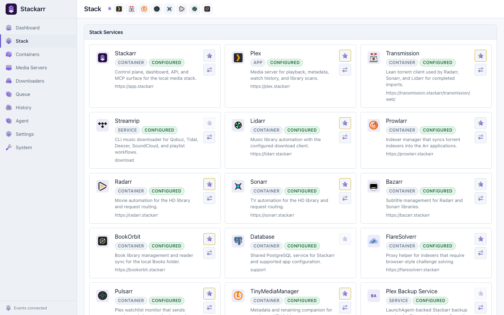
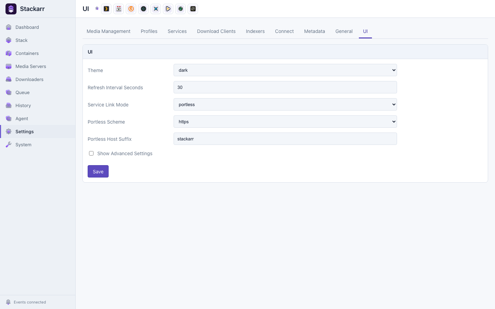

<div align="center">
  
  <h1>Stackarr</h1>
  <p><strong>Private, arr-style media stack control plane for local-first home servers.</strong></p>
  <p>
    <a href="https://github.com/b-bot/Stackarr">Star on GitHub</a>
    ·
    <a href="https://stackarr.app/docs">Docs</a>
    ·
    <a href="https://stackarr.app/docs/installation">Install</a>
    ·
    <a href="https://stackarr.app/docs/agent/mcp">Agent MCP</a>
    ·
    <a href="CONTRIBUTING.md">Contributing</a>
  </p>
  <p>
    <a href="https://github.com/b-bot/Stackarr">
      
    </a>
  </p>
</div>

<picture>
  <source media="(prefers-color-scheme: dark)" srcset="apps/docs/public/screenshots/stackarr-dashboard-dark.png" />
  
</picture>

---

Stackarr is an arr-style control plane for running a private media stack from a local web dashboard. It wraps setup, service wiring, runtime settings, backups, and trusted-agent maintenance around familiar tools such as Sonarr, Radarr, Prowlarr, Plex, Jellyfin, Seerr, Transmission, and qBittorrent.

> [!WARNING]
> Stackarr is alpha software. Keep the app bound to `127.0.0.1` until the API key, Cloudflare, and public URL settings are configured.

## Quick Start

Development checkout:

```bash
corepack enable
pnpm install
pnpm dev
```

Open `http://127.0.0.1:7777/setup`.

Docker or packaged installs are covered in [docs/install.md](docs/install.md).

## Support The Project

If Stackarr looks useful, please [star `b-bot/Stackarr` on GitHub](https://github.com/b-bot/Stackarr). Stars help new self-hosters discover the project, give contributors a visible signal, and make release posts easier to trust. Watching releases, sharing the docs with home-server communities, and opening focused issues or pull requests help too.

## What It Manages

| Surface | Stackarr handles |
| --- | --- |
| **Dashboard + API** | A Next.js local dashboard and arr-style `/api/v1` API. |
| **Media services** | Docker services for movies, TV, music, books, requests, subtitles, metadata, and indexers. |
| **Media servers** | Native or Docker Plex and Jellyfin modes, selected independently. |
| **Operations** | Setup, settings, stack lifecycle commands, backups, updates, and diagnostics. |
| **Agent control** | Optional local stdio MCP integrations for trusted coding/automation agents. |
| **Access** | Optional Cloudflare, Portless, and local-only service routing. |

## Key Screens

| Stack services | UI settings |
| --- | --- |
| <picture><source media="(prefers-color-scheme: dark)" srcset="apps/docs/public/screenshots/stackarr-stack-services-dark.png" /></picture> | <picture><source media="(prefers-color-scheme: dark)" srcset="apps/docs/public/screenshots/stackarr-settings-ui-dark.png" /></picture> |

## Docs

- [Installation](docs/install.md)
- [Architecture](docs/ARCHITECTURE.md)
- [MCP and agent integrations](docs/mcp.md)
- [Manual verification](docs/MANUAL_VERIFICATION.md)
- [Distribution packaging](distribution/README.md)
- [Contributing](CONTRIBUTING.md)
- [Public docs source](apps/docs/content/docs/index.mdx)

## Repo Layout

| Path | Purpose |
| --- | --- |
| `apps/frontend` | Local Stackarr dashboard and `/api/v1` API. |
| `apps/docs` | Fumadocs landing/docs deployment app. |
| `packages/core` | Shared config, task, service, connection, and notification logic. |
| `packages/ui` | Shared presentation primitives. |
| `packages/cli` | `stackarr` executable wrapper package. |
| `packages/mcp` | Local stdio MCP server for trusted agents. |
| `packages/agent-plugins` | Path-portable Hermes/OpenClaw plugin templates. |
| `distribution` | Release packaging. |
| `docs` | Maintainer and integration notes. |
| `skills` | Agent-facing setup and maintenance instructions. |
| `stackarr` | Scripts, presets, hooks, and Docker Compose stack. |

Runtime configuration lives in app settings, environment variables, prompts, and local state. Do not publish ignored runtime state such as databases, secrets, logs, generated build output, or machine-specific app data.

## License

Stackarr is licensed under [GPL-3.0-only](LICENSE).
